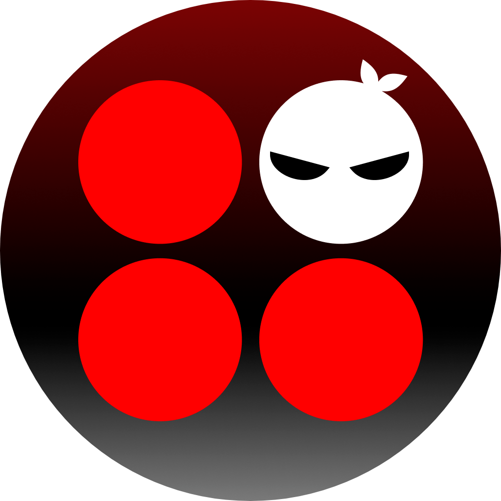

<!-- PROJECT LOGO -->
 

  
  <h3 align="center">iOS Game - Color Ninja</h3>

## About Color Ninja
**Color Ninja** is a game project using Swift, the purpose is to get familiar with Swift and some popular frameworks such as: Alamofire, SnapKit, ... 
Color Ninja is a simple game, just find out different colors in the grid of colors and tap it. It has been published to the **AppStore**, you can download and try it [here](https://apps.apple.com/vn/app/find-different-color-2-players/id1516759930)

## Features
- Single player
- Match 2 random players
- Play with friend by Room Id

## License
Distributed under the MIT License. See `LICENSE` for more information.

## Contact
Submit an issue or email me if you have any questions.  [doleduy97@gmail.com](mailto:doleduy97@gmail.com)
